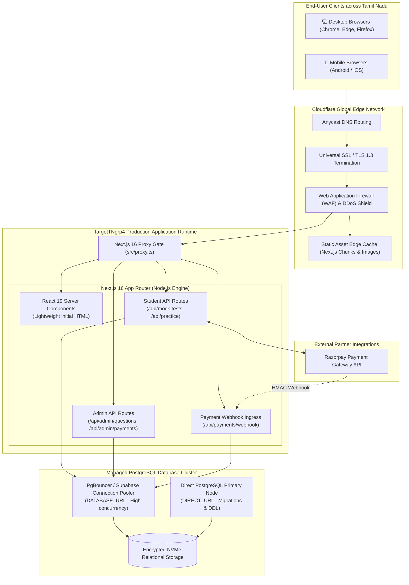

# 📊 Diagram: Deployment & Cloud Infrastructure Topology

Network routing, edge termination, compute boundaries, and database connectivity powering TargetTNgrp4.

```mermaid
flowchart TB
    subgraph Users["End-User Clients across Tamil Nadu"]
        DESKTOP["💻 Desktop Browsers (Chrome, Edge, Firefox)"]
        MOBILE["📱 Mobile Browsers (Android / iOS)"]
    end

    subgraph Edge["Cloudflare Global Edge Network"]
        DNS["Anycast DNS Routing"]
        SSL["Universal SSL / TLS 1.3 Termination"]
        WAF["Web Application Firewall (WAF) & DDoS Shield"]
        CACHE["Static Asset Edge Cache (Next.js Chunks & Images)"]
    end

    subgraph Host["TargetTNgrp4 Production Application Runtime"]
        PROXY["Next.js 16 Proxy Gate (src/proxy.ts)"]
        
        subgraph AppRouter["Next.js 16 App Router (Node.js Engine)"]
            RSC["React 19 Server Components<br/>(Lightweight initial HTML)"]
            API_STUDENT["Student API Routes<br/>(/api/mock-tests, /api/practice)"]
            API_ADMIN["Admin API Routes<br/>(/api/admin/questions, /api/admin/payments)"]
            WEBHOOK["Payment Webhook Ingress<br/>(/api/payments/webhook)"]
        end
    end

    subgraph DatabaseTier["Managed PostgreSQL Database Cluster"]
        POOLER["PgBouncer / Supabase Connection Pooler<br/>(DATABASE_URL - High concurrency)"]
        DIRECT["Direct PostgreSQL Primary Node<br/>(DIRECT_URL - Migrations & DDL)"]
        STORAGE[("Encrypted NVMe Relational Storage")]
    end

    subgraph ThirdParty["External Partner Integrations"]
        RAZORPAY["Razorpay Payment Gateway API"]
    end

    Users --> DNS
    DNS --> SSL
    SSL --> WAF
    WAF --> CACHE
    WAF --> PROXY

    PROXY --> RSC
    PROXY --> API_STUDENT
    PROXY --> API_ADMIN
    PROXY --> WEBHOOK

    API_STUDENT --> POOLER
    API_ADMIN --> POOLER
    WEBHOOK --> POOLER
    
    POOLER --> STORAGE
    DIRECT --> STORAGE

    API_STUDENT <--> RAZORPAY
    RAZORPAY -.->|HMAC Webhook| WEBHOOK
```
